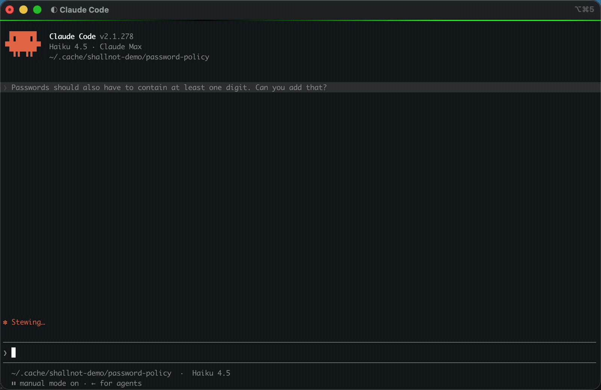

# shallnot-demo

A small password-policy module whose CI is gated by
[shallnot](https://github.com/RachidChabane/shallnot): every requirement in
[`specs/password-policy.md`](specs/password-policy.md) must be cited by a test
that ran and passed.

- The requirements are declared as `PWD-1~1`, `PWD-2~1`, ... in the spec.
- The tests cite them with `@pytest.mark.verifies("PWD-1~1")`;
  [`conftest.py`](conftest.py) copies the marker into pytest's JUnit XML.
- [`.github/workflows/ci.yml`](.github/workflows/ci.yml) runs pytest, then the
  shallnot action, which reads [`shallnot.yaml`](shallnot.yaml), writes its
  summary to the job summary and annotates the offending lines.

The [Actions history](../../actions) shows both verdicts: the run of the first
commit is blocked because `PWD-2~1` has no test, and the run of the commit
that adds the test and the behaviour passes.

## An agent uses it without being asked

The repository is equipped by `shallnot init`: [`AGENTS.md`](AGENTS.md) and a
project skill tell a coding agent the convention, and an end-of-turn hook in
[`.claude/settings.json`](.claude/settings.json) holds the agent's turn until
the gate passes. Ask an agent for a feature that a requirement describes, and
it tags the tests it writes and runs the gate on its own:



## Run it locally

```sh
python -m pip install pytest
shallnot gate
```

`shallnot gate` runs the test command of [`shallnot.yaml`](shallnot.yaml),
then checks the results it wrote.
